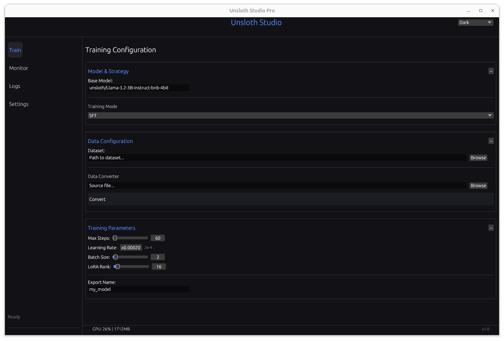
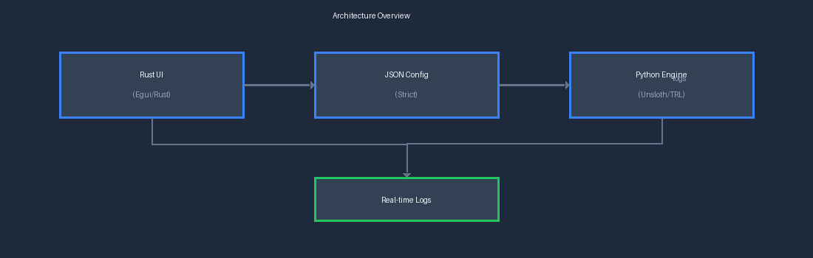

# Unsloth Studio

**Fine-Tune LLMs with a Beautiful, Native Desktop Interface**

[](https://www.rust-lang.org) [](https://www.python.org) [](LICENSE) [](https://en.wikipedia.org/wiki/Linux) [](https://developer.nvidia.com/cuda-toolkit)

---



---

## Quick Start

1. **Install Unsloth** — See the [Installation](#installation) section
2. **Download Unsloth Studio** via Docker (recommended) or binary
3. **Launch the application** and point it to your Python environment
4. **Load a dataset** using the built-in converter
5. **Configure training** and hit **Start Training**

---

## Table of Contents

- [Overview](#overview)
- [Features](#features)
- [Installation](#installation)
- [Getting Started](#getting-started)
- [Interface Guide](#interface-guide)
- [Performance](#performance-zero-overhead)
- [Project Structure](#project-structure)
- [License](#license)

---

## Overview

**Unsloth Studio** is a powerful, standalone desktop application that wraps the industry-leading [Unsloth](https://github.com/unslothai/unsloth) library in a high-performance Rust GUI.

With an intuitive interface, you can:

- Upload datasets with drag-and-drop simplicity
- Configure training parameters without writing code
- Monitor progress with real-time visualization
- Choose your theme (Dark, Light, or Cyberpunk)

The application supports **SFT (Supervised Fine-Tuning)** and **GRPO (DeepSeek-style Reasoning)** with memory-efficient training through 4-bit quantization and LoRA adapters.

> **Note:** Unsloth provides 2-5x faster training with 70% less memory usage compared to standard fine-tuning.

---

## Features

| Feature | Description |
|---------|-------------|
| Native Performance | Written in Rust (Egui). Uses <50MB RAM when idle |
| GRPO Support | Train reasoning models with a simple checkbox |
| Data Tools | Built-in converter transforms messy CSV/JSON/JSONL files |
| Real-Time Visualization | Watch Loss (SFT) or Reward (GRPO) curves update live |
| Portable | Connects to your existing local Python/Conda environment |
| Theming | Includes Dark, Light, and Cyberpunk themes |

---

## Installation

### Prerequisites

| Requirement | Details |
|-------------|---------|
| **OS** | Linux (Recommended) or Windows (Must use WSL2) |
| **GPU** | NVIDIA GPU with CUDA 12.1+ drivers installed |
| **Python** | Python 3.10+ (Conda environment recommended) |
| **Docker** | Docker, Docker Compose, and NVIDIA Container Toolkit |

---

### Install Unsloth (Backend)

```bash
# Create and activate conda environment
conda create --name unsloth_env python=3.10
conda activate unsloth_env

# Install PyTorch and Unsloth
pip install "unsloth[colab-new] @ git+https://github.com/unslothai/unsloth.git"
pip install --no-deps "xformers<0.0.26" "trl<0.9.0" peft accelerate bitsandbytes pandas
```

> **Important:** These commands assume CUDA 12.1. If you have a different version, check the [Unsloth Installation Guide](https://github.com/unslothai/unsloth).

---

### Download Unsloth Studio

#### Option A: Docker (Recommended)

Run the entire application in a container with GPU support and all dependencies pre-installed.

**Requirements:**
- Docker and Docker Compose installed
- NVIDIA Container Toolkit (for GPU access)
- X11 server running (for GUI display)

**Using Docker Compose:**

```bash
# Clone the repo
git clone https://github.com/noobezlol/Unsloth_Studio.git
cd Unsloth-Studio

# On Linux, allow GUI access first:
xhost +local:root

# Build and run the container
docker compose up --build
```

**Data Persistence:**

| Directory | Purpose |
|-----------|---------|
| `./outputs` | Trained models are saved here |
| `./training_data` | Mount your datasets here |

---

#### Option B: Binary Release

Download the latest release from the [Releases page](https://github.com/noobezlol/Unsloth_Studio/releases), unzip it, and run the executable.

---

#### Option C: Build from Source

```bash
# Clone the repo
git clone https://github.com/noobezlol/Unsloth_Studio.git
cd Unsloth-Studio

# Build the Rust UI
cd launcher
cargo build --release

# Run
./target/release/launcher
```

---

## Getting Started

### Initial Setup

**For Native/Binary/Source Builds:**

On first launch, the app will ask for your Python Executable Path.

> **Example:** `/home/user/miniconda3/envs/unsloth_env/bin/python`

This setting is saved automatically.

**For Docker:**

No setup needed. Python path is pre-configured to `/usr/bin/python3` with all dependencies installed. Just launch and start training.

---

### Prepare Your Dataset

You don't need to format data manually. Use the **Data Converter**:

1. Click **"Browse"** in the Data Tools section
2. Select your messy source file (`.csv`, `.json`, `.txt`)
3. Click **"Convert"**
4. The app will auto-format it and load it for training

---

#### Supported Native Formats

| Format | Structure |
|--------|-----------|
| **Alpaca** | `{"instruction": "...", "input": "...", "output": "..."}` |
| **ShareGPT** | `{"conversations": [{"from": "human", "value": "..."}]}` |
| **OpenAI** | `{"messages": [{"role": "user", "content": "..."}]}` |
| **Raw Text** | `{"text": "..."}` |

**Example (Alpaca format):**
```json
{
  "instruction": "What is the capital of France?",
  "input": "",
  "output": "The capital of France is Paris."
}
```

---

## Interface Guide

### Training Strategies

| Mode | Description | Best For |
|------|-------------|----------|
| **SFT** | Supervised Fine-Tuning | Chatbots, Roleplay, Instruction Following |
| **GRPO** | Group Relative Policy Optimization | Logic Puzzles, Math, Reasoning (DeepSeek style) |

---

### GRPO Rewards (Reasoning Mode)

When GRPO is selected, you can enable specific reward functions:

| Reward Type | Effect |
|-------------|--------|
| **Length-based Rewards** | Encourages the model to write longer, more detailed chains of thought |
| **DeepSeek XML Format** | Rewards the model for correctly using `<think>` tags to separate reasoning from the final answer |

---

### Key Parameters

| Parameter | Recommended Value | Description |
|-----------|-------------------|-------------|
| **Steps** | 60 (for testing) | Total training steps |
| **Learning Rate** | 2e-4 (for SFT) | Training learning rate |
| **LoRA Rank** | 16 (default) | Higher = smarter but uses more VRAM |

---

## Performance: Zero Overhead

Unsloth Studio introduces **zero performance loss** compared to running scripts manually.

1. The Rust UI generates a strict JSON config
2. It spawns the Python engine as a subprocess
3. Training runs 100% in native Python using Hugging Face TRL & Unsloth
4. Logs are piped back to the UI for visualization

> All optimizations (Flash Attention 2, 4-bit quantization, Gradient Checkpointing) work exactly as they do in the terminal.

---

## Project Structure

```
Unsloth-Studio/
├── launcher/                  # The Rust GUI Application
│   └── src/main.rs            #    Main Interface Logic
├── engine/                    # The Python Engine
│   ├── main.py                #    Entry Point
│   ├── backends/              #    Unsloth & Training Logic
│   └── core/                  #    Config Schemas
├── tools/                     # Python Utilities
│   └── converter.py           #    Dataset Converter
├── configs/                   # Saved Run Configurations
├── training_data/             # Training Datasets
├── outputs/                   # Where your trained models go
├── architecture_diagram.png  # System Architecture Diagram
└── README.md                 # This file
```



---

## License

MIT License. Free to use for personal and commercial projects.

---

## Disclaimer

This is an **unofficial GUI** and is not affiliated with Unsloth AI directly.

- Please report **GUI issues** here
- Please report **core training issues** to [Unsloth](https://github.com/unslothai/unsloth)

---

**Built with Rust, Python, and Unsloth**
